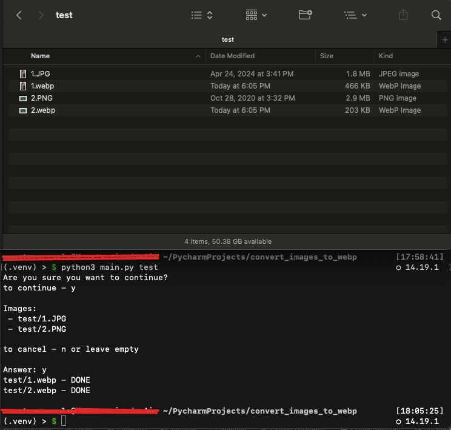

# Image to WebP Converter

This script converts images or directories of images to the WebP format using Python. It supports multiple image formats including JPEG, PNG, GIF, BMP, TIFF, and HEIC.

## Features

- Converts single image files or entire directories.
- Supports a wide range of image formats.
- Uses the `Pillow` library for image processing and `pillow_heif` for HEIC support.

## Requirements

- Python 3.x
- Pillow
- pillow_heif

## Installation

1. Install the required Python packages:

    ```sh
    pip install Pillow pillow_heif
    ```

2. Save the script to a file, for example `convert_to_webp.py`.

## Usage

To convert a single image file:

```sh
python convert_to_webp.py /path/to/image.jpg
```


To convert all images in a directory:
```sh
python convert_to_webp.py /path/to/directory/
```
If no path is provided, the script will use the current directory by default.

## Screenshots
*Usage example and result*


